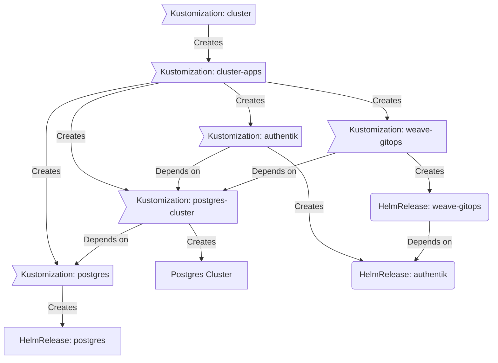

<div align="center">


### My Homelab Repository :snowflake:

_... automated via [Flux](https://fluxcd.io), [Renovate](https://github.com/renovatebot/renovate) and [GitHub Actions](https://github.com/features/actions)_ 🤖

</div>
<div align="center">

[](https://discord.gg/home-operations)&nbsp;&nbsp;
[]()&nbsp;&nbsp;
<!-- [](https://github.com/chaijunkin/home-ops/actions/workflows/renovate.yaml) -->

</div>

<div align="center">

<!-- [](https://status.cloudjur.com)&nbsp;&nbsp; -->
[](https://status.cloudjur.com/endpoints/external_gatus)&nbsp;&nbsp;
<!-- [](https://status.cloudjur.com/endpoints/external_plex) -->

</div>

<div align="center">

[](https://github.com/kashalls/kromgo/)&nbsp;&nbsp;
[](https://github.com/kashalls/kromgo/)&nbsp;&nbsp;
[](https://github.com/kashalls/kromgo/)&nbsp;&nbsp;
[](https://github.com/kashalls/kromgo/)&nbsp;&nbsp;
[](https://github.com/kashalls/kromgo/)&nbsp;&nbsp;
[](https://github.com/kashalls/kromgo/)&nbsp;&nbsp;
[](https://github.com/kashalls/kromgo)&nbsp;&nbsp;
[](https://github.com/kashalls/kromgo)

</div>

---

## Overview

This is a monorepository is for my home k3s clusters.
I try to adhere to Infrastructure as Code (IaC) and GitOps practices using tools like [Ansible](https://www.ansible.com/), [Terraform](https://www.terraform.io/), [Kubernetes](https://kubernetes.io/), [Flux](https://github.com/fluxcd/flux2), [Renovate](https://github.com/renovatebot/renovate), and [GitHub Actions](https://github.com/features/actions).

The purpose here is to learn k8s, while practicing Gitops.

---

## ⛵ Kubernetes

There is a template over at [onedr0p/flux-cluster-template](https://github.com/onedr0p/flux-cluster-template) if you want to try and follow along with some of the practices I use here.

### Installation

My cluster is [k3s](https://k3s.io/) provisioned overtop bare-metal Debian using the [Ansible](https://www.ansible.com/) galaxy role [ansible-role-k3s](https://github.com/PyratLabs/ansible-role-k3s). This is a semi-hyper-converged cluster, workloads and block storage are sharing the same available resources on my nodes while I have a separate NAS server with ZFS for NFS/SMB shares, bulk file storage and backups.

### Configuration


### Taskfile Usage for Fly Apps

This repository uses [Taskfile](https://taskfile.dev) to automate Fly app management. Each Fly app task loads its environment variables from a per-app `.config.env` file, ensuring isolation and security for each app.

#### How it works

- Each Fly app (e.g., `gatus`) has its own directory under `infrastructure/flyio/<APP>` containing a `.config.env` file with the required environment variables for that app.
- The Taskfile tasks (e.g., `fly:app:create`, `fly:app:deploy`, `fly:volume:create`, etc.) use the `APP` variable to select which app to operate on.
- When you run a task, the Taskfile loads the environment from `infrastructure/flyio/<APP>/.config.env` using the `dotenv:` key at the task level. This ensures all commands for that app use the correct environment.

#### Example: Using the Taskfile with the `gatus` app

Suppose you want to deploy or manage the `gatus` Fly app. First, ensure you have a `.config.env` file at `infrastructure/flyio/gatus/.config.env` with all required variables.

To create a volume for `gatus`:

```sh
task fly:volume:create APP=gatus
```

To deploy the app:

```sh
task fly:app:deploy APP=gatus
```

To view logs:

```sh
task fly:app:logs APP=gatus
```

All these commands will automatically load environment variables from `infrastructure/flyio/gatus/.config.env`.

> **Note:** You do not need to manually export environment variables or use a global `.config.env`. Each app is fully isolated.

---

### Configuration

The `.config.env` file contains environment variables needed to deploy the apps in this template. Each app has its own `.config.env` file as described above.

1. Copy the `.config.sample.env` to `.config.env` in the appropriate app directory and fill out all the environment variables. **All uncommented variables are required**.

### [Fly.io] setup

For some commands below, we use a task instead of `flyctl` because we
the task writes (on app creation) and reads (subsequent commands) your
app name from the config file. This is the only way to keep your app
name hidden.

1. Signup to Fly

   If you already have a Fly account, use `flyctl auth login` instead.

   ```sh
   flyctl auth signup
   ```

1. Create a new fly app

   If this is your first app, you'll be asked to add credit card
   information, but, don't worry, you'll not be charged by this app.

   ```sh
   task fly:app:create APP=gatus
   ```

1. Create a new volume

   This will show you a warning about invididual volumes.
   It's ok to have a single volume because we're not
   concerned about downtime for our gatus instance.

   ```sh
   task fly:volume:create APP=gatus
   ```

1. Deploy your app

   ```sh
   task fly:app:deploy APP=gatus
   ```

1. Setup your custom domain

   After your app is deployed, follow the steps [here](https://fly.io/docs/app-guides/custom-domains-with-fly/) to setup your custom domain.

1. Open your new gatus website

   That's all! Now you can open your custom domain and gatus should
   work.

## Keeping dependencies up to date

This template uses [Renovatebot](https://www.mend.io/free-developer-tools/renovate/) to scan and open new PRs when dependencies are out of date.

To enable this, open their [Github app](https://github.com/apps/renovate) page, click the "Configure" button, then choose your repo. The template already provides Renovate configs and there's no need for further action.

## Troubleshooting

If your deployment failed or you can't open gatus web, you can see
the logs with:

```sh
task fly:app:logs APP=gatus
```

If that command fails (eg, if the machine is stopped), try opening your
logs in the browser:

```sh
task fly:app:logs:web APP=gatus
```

You can also ssh in the machine with:

```sh
task fly:app:ssh
```

and check individual logs using [overmind](https://github.com/DarthSim/overmind):

```sh
# Run this command inside your fly machine
overmind connect gatus
```

This will open a tmux window with gatus logs.
You can scroll your tmux window with `Ctrl-B-]` and use
`Ctrl-B-D` to exit the tmux window.

Substitute `gatus` with `caddy`, or `backup` to see logs for
other apps.

## Continuous deployment

After your first manual deploy to Fly.io, per instructions above, you can setup continuous deployment via Github Actions.

1. Install [Github CLI](https://cli.github.com)

   ```sh
   brew install gh
   ```

1. Login to Github

   ```sh
   gh auth login
   ```

1. Set Fly secrets to your Github repo

   ```sh
   task github:secrets:set
   ```

1. Test your workflow deployment

   ```sh
   task github:workflow:deploy
   ```

That's all! Now, any changes to your `Dockerfile`, `fly.toml` or
`scripts`/`config` will trigger a fly deploy.

## FAQ

1. Why every `fly` command I run errors with: `Error: the config for your app is missing an app name`?

   For security reasons the app name is not sdaved in the [fly.toml] file.
   In that case, you have to add `-a your-app-name` to all `fly` commands.

   Your app name is found in your `.config.env` file.

   Example:

   ```sh
   fly secrets list -a your-app-name
   ```

   Or you can add:

   ```yaml
   app = "your-app-name"
   ```

   to the beginning of your [fly.toml] file.

2. How do I update the environment variables?

   After updating the `.config.env` file, you can update your environment variables in two different ways:

   ```sh
   task fly:secrets:set APP=gatus
   ```

   will read your `.config.env` file and import every defined variable to your fly app, Or you can just do a new deployment:

   ```sh
   task fly:app:deploy APP=gatus
   ```

   which will run the command above and do a new deployment afterwards.

[Fly.io]: https://fly.io
[fly.toml]: fly.toml


### Core Components

- [actions-runner-controller](https://github.com/actions/actions-runner-controller): self-hosted Github runners
- [cilium](https://github.com/cilium/cilium): internal Kubernetes networking plugin
- [cert-manager](https://cert-manager.io/docs/): creates SSL certificates for services in my cluster
- [external-dns](https://github.com/kubernetes-sigs/external-dns): automatically syncs DNS records from my cluster ingresses to a DNS provider
- [external-secrets](https://github.com/external-secrets/external-secrets/): managed Kubernetes secrets using [Bitwarden](https://bitwarden.com/).
- [ingress-nginx](https://github.com/kubernetes/ingress-nginx/): ingress controller for Kubernetes using NGINX as a reverse proxy and load balancer
- [sops](https://toolkit.fluxcd.io/guides/mozilla-sops/): managed secrets for Kubernetes, Ansible, and Terraform which are committed to Git
- [tf-controller](https://github.com/weaveworks/tf-controller): additional Flux component used to run Terraform from within a Kubernetes cluster.
- [volsync](https://github.com/backube/volsync): backup and recovery of persistent volume claims

### GitOps

[Flux](https://github.com/fluxcd/flux2) watches the clusters in my [kubernetes](./kubernetes/) folder (see Directories below) and makes the changes to my clusters based on the state of my Git repository.

The way Flux works for me here is it will recursively search the `kubernetes/apps` folder until it finds the most top level `kustomization.yaml` per directory and then apply all the resources listed in it. That aforementioned `kustomization.yaml` will generally only have a namespace resource and one or many Flux kustomizations. Those Flux kustomizations will generally have a `HelmRelease` or other resources related to the application underneath it which will be applied.

[Renovate](https://github.com/renovatebot/renovate) watches my **entire** repository looking for dependency updates, when they are found a PR is automatically created. When some PRs are merged Flux applies the changes to my cluster.

### Directories

This Git repository contains the following directories under [Kubernetes](./kubernetes/).

```sh
📁 kubernetes
│── 📁 apps           # applications
│── 📁 bootstrap      # bootstrap procedures
│── 📁 flux           # core flux configuration
│── 📁 templates      # re-useable components

```

### Flux Workflow

This is a high-level look how Flux deploys my applications with dependencies. Below there are 3 apps `postgres`, `authentik` and `weave-gitops`. `postgres` is the first app that needs to be running and healthy before `authentik` and `weave-gitops`. Once `postgres` is healthy `authentik` will be deployed and after that is healthy `weave-gitops` will be deployed.



---

## ☁️ Cloud Dependencies

While most of my infrastructure and workloads are self-hosted I do rely upon the cloud for certain key parts of my setup. This saves me from having to worry about two things. (1) Dealing with chicken/egg scenarios and (2) services I critically need whether my cluster is online or not.

The alternative solution to these two problems would be to host a Kubernetes cluster in the cloud and deploy applications like [HCVault](https://www.vaultproject.io/) and [ntfy](https://ntfy.sh/). However, maintaining another cluster and monitoring another group of workloads is a lot more time and effort than I am willing to put in.

| Service                                         | Use                                                               | Cost           |
|-------------------------------------------------|-------------------------------------------------------------------|----------------|
| [Bitwarden](https://bitwarden.com/)             | Secrets with [External Secrets](https://external-secrets.io/)     | ~$TBC/yr       |
| [Cloudflare](https://www.cloudflare.com/)       | Domain and S3                                                     | ~$TBC/yr       |
| [GitHub](https://github.com/)                   | Hosting this repository and continuous integration/deployments    | Free           |
| [Gatus](https://gatus.ioi/)          | Monitoring internet connectivity and external facing applications | Free           |
|                                                 |                                                                   | Total: ~$TBC/mo|

---

## 🔧 Hardware

### Kubernetes Cluster

| Name        | Device | CPU | OS Disk   | Data Disk | RAM  | OS     | Purpose           |
|-------------|--------|-----| ----------|-----------|------|--------|-------------------|

First server (running NAS + compute home server)

| Component | Specification |
|-----------|---------------|
| CPU | Intel E-2246G 3.6GHz (base) Xeon — 6 cores / 12 threads |
| RAM | 64GB ECC Kingston |
| Motherboard | Gigabyte C246-WU4 Workstation/Server |
| OS Disk | 500GB Samsung Evo 850 SSD |
| NVMe | 1TB Samsung 970 Evo Plus NVMe |
| NAS/Data Disks | Seagate IronWolf / EXOS — various (1TB / 2TB / 4TB / 6TB / 8TB / 10TB) x2 (7200RPM, 256MB, CMR) |
| Networking | Intel WiFi-6 AX201 PCIe |
| Cooling | Be Quiet! Dark Rock Slim |
| PSU | Corsair AX760 |
| Case | Lian-Li PC-7H Full Aluminum ATX |

Note: PROPOSING TO DECOUPLE NAS AND HOME SERVER — budget constrained (3rd world country costs). This is a proposed architecture change; details and migration plan are tracked elsewhere in the repo.

### Supporting Hardware


The rest of the homelab and network devices include:

| Device | Purpose / Notes |
|--------|-----------------|
| HORACO 2.5GbE Managed Switch (8-port 2.5GBASE-T, 10G SFP+ uplink) | Core LAN switching / aggregation |
| PiKVM-A3 (for Raspberry Pi) | Remote KVM management for hardware access |
| Intel N100 Celeron N5105 fanless mini PC (Aliexpress model) | Soft-router / pfSense / ESXi-capable device; 4x Intel i226/i225 2.5G LAN ports, HD/DP — used as edge firewall/router |
| TP-LINK EAP670 AX5400 Ceiling Mount WiFi 6 Access Point | Wireless coverage (ceiling mount) |
| PoE Cameras | reolink_rlc1212a_frontdoor, reolink_rlc520a_upstair, reolink_rlc811a_backdoor, reolink_rlc520a_dining |
| D-Link DES-F1010P-E (10-port PoE switch, 8 PoE + 2 uplink; 93W budget) | Powers PoE cameras / APs |
| TP-Link TL-SG108E (8-Port Easy Smart Switch) | Small L2 management switch for edge/office |

### Networking/UPS Hardware


| Device | Purpose |
|--------|---------|
| Mini PC (Aliexpress Intel N100 / N5105) | Edge router / firewall appliance |
| TP-LINK EAP670 | Primary wireless AP (ceiling mount) |
| HORACO 2.5GbE switch | Primary LAN switch (2.5G uplinks) |
| TP-Link TL-SG108E | Small managed L2 switch for office/VLANs |
| D-Link DES-F1010P-E | PoE switch for cameras / APs (93W power budget) |
| UPS | (TBD — planned) |

## Estimated power consumption ⚡

Assumptions: these are rough, conservative estimates for typical (idle/average) and peak loads. Real consumption depends on workload, drive spin-up, PoE loads, and UPS efficiency. I assume a UPS/inverter efficiency of ~90% for mains draw calculations.

| Item | Typical (W) | Peak (W) | Notes |
|------|-------------:|---------:|-------|
| First server (E-2246G, 64GB, NVMe + SATA SSD + 2x HDD) | 120 | 230 | Typical under light/medium home-lab load; peak under full CPU+disk IO |
| HORACO 2.5GbE managed switch (8-port + SFP+) | 25 | 30 | Fanless small managed switch |
| PiKVM-A3 (Raspberry Pi) | 5 | 6 | Low-power remote KVM board |
| Intel N100 / N5105 mini PC (edge router) | 20 | 35 | Typical for fanless mini-PC, spikes under load/VPN/ESXi usage |
| TP-LINK EAP670 AP | 12 | 20 | PoE/AC/AP radio active under clients |
| D-Link DES-F1010P-E (PoE switch) - switch chassis | 15 | 20 | Switch chassis overhead (PoE separate) |
| Cameras (4x Reolink, listed models) - total | 32 | 40 | ~8W each typical, up to ~10W peak each |
| TP-Link TL-SG108E | 6 | 8 | Small L2 switch |

Totals:

- Total typical IT load: 235 W
- Total peak IT load: 388 W

Accounting for UPS/inverter inefficiency (~90%):

- Mains draw (typical) ≈ 235 W / 0.9 ≈ 261 W (0.261 kW)
- Mains draw (peak)  ≈ 388 W / 0.9 ≈ 431 W (0.431 kW)

Estimated energy consumption:

- Daily (typical): 0.261 kW × 24 h ≈ 6.26 kWh/day
- Monthly (30d, typical): ≈ 187.9 kWh/month

Notes & next steps:
- These are estimates to help size UPS, breakers, and monthly energy costs. If you want, I can: compute estimated monthly cost for your local electricity rate, produce a per-device YAML inventory with the wattages, or create a small PowerPoint/CSV for UPS sizing and redundancy.

---

## 🚀 Deployment Tasks

This repository includes several Taskfile tasks to automate infrastructure provisioning and cluster configuration:

### Proxmox Infrastructure

- **init**
  Initializes the Terraform working directory for Proxmox infrastructure.
  ```sh
  task talos:init
  ```
  - Runs `terraform init` in `infrastructure/terraform/proxmox`.

- **apply**
  Applies the Terraform configuration to provision/update Proxmox infrastructure.
  ```sh
  task talos:apply
  ```
  - Runs `terraform apply -auto-approve` in `infrastructure/terraform/proxmox`.

> See `.taskfiles/talos/Taskfile.yaml` for more details and additional tasks.

---

## ⭐ Stargazers

<div align="center">

[](https://star-history.com/#chaijunkin/home-ops&Date)

</div>

---

## 🤝 Thanks

Big shout out to original [flux-cluster-template](https://github.com/onedr0p/flux-cluster-template), and the [Home Operations](https://discord.gg/home-operations) Discord community.

Be sure to check out [kubesearch.dev](https://kubesearch.dev/) for ideas on how to deploy applications or get ideas on what you may deploy.

---

## 📜 Changelog

See my _awful_ [commit history](https://github.com/chaijunkin/home-ops/commits/main)

ARCHIVES FOLDER IS REMOVED ON Aug 10 14:20:50

---

## 🔏 License

See [LICENSE](./LICENSE)
