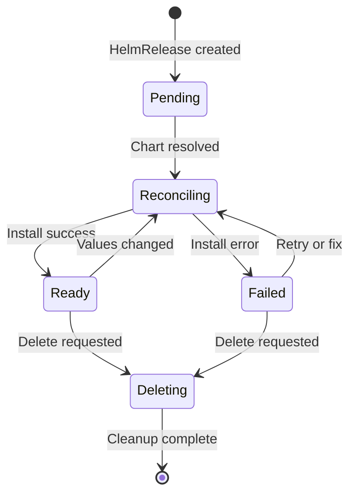
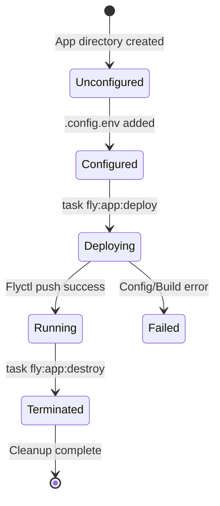

# Homelab Domain Model

**Purpose**: The conceptual model, business rules, and state machines that govern the `chaijunkin/home-ops` infrastructure.

**Scope**: Domain logic and invariants, not implementation details (those are in ARCHITECTURE.md).

---

## Core Rules

### Rule 1: GitOps is the source of truth

**Rule**: All Kubernetes changes flow through Git. Manual cluster changes revert on the next reconciliation.
**Enforced By**: Flux reconciliation loop.
**Violation**: `kubectl edit deployment my-app` changes are overwritten.
**Why**: Ensures cluster state is auditable, reproducible, and version-controlled.

---

### Rule 2: Storage is Purpose-Built

**Rule**: The storage layer uses specific technologies based on the workload's performance profile.
**Enforced By**: The specific StorageClasses requested in `HelmReleases`.
**Decision Matrix**:

| Use Case | Storage Tool | Backed By | Notes |
|----------|--------------|-----------|-------|
| Normal stateful storage & VolSync snapshots | `democratic-csi` | Host SSD Boot Drive | The primary fast storage for stateful apps. |
| Cache & Heavy write workloads | `openebs` | Secondary Drives | Avoids burning out the primary boot SSD. |
| Bulk storage (Media/Downloads) | `csi-driver-nfs` | Ansible-deployed NFS | Consumes the native Proxmox ZFS `/tank` exports. |

---

### Rule 3: Secrets are Encrypted at Rest in Git

**Rule**: All secrets MUST be encrypted using SOPS (with Age keys) and committed as `*.sops.yaml`.
**Enforced By**: PR reviewers and `task sops:encrypt`.
**Violation**: Committing a plain-text secret compromises the entire repository.
**Why**: Allows the repository to be public while keeping credentials secure.

---

### Rule 4: Secrets are Extracted from Bitwarden

**Rule**: Application-level secrets (like API keys) are injected into the cluster dynamically using `ExternalSecret` objects that pull from a Bitwarden/Vaultwarden instance via a `ClusterSecretStore`.
**Enforced By**: `ExternalSecrets` Operator pointing to `bitwarden-fields`.
**Example**:
An app requires a TMDB API key. Instead of creating a Kubernetes Secret directly, an `ExternalSecret` is defined that extracts the field from a Bitwarden item GUID.

---

### Rule 5: Stateful PVCs Must Be Backed Up via VolSync

**Rule**: Any application claiming a persistent volume (PVC) for critical state must have that state replicated via VolSync.
**Enforced By**: Kustomize components (`components/volsync`).
**Example**:
When an app requires backups, the `volsync` component is injected into its `ks.yaml`. This automatically provisions a `ReplicationSource` that uses Kopia to snapshot the PVC to a local Minio bucket and a remote Cloudflare R2 bucket.

---

### Rule 6: Databases Use Specialized High-Performance Storage

**Rule**: CloudNativePG (PostgreSQL) databases prioritize performance and durability by using `local-hostpath` storage combined with Barman S3 backups, rather than standard network-attached PVCs.
**Enforced By**: `Cluster` CRD in `kubernetes/apps/database/cloudnative-pg/cluster`.
**Decision Matrix**:

| Component | Choice | Rationale |
|-----------|--------|-----------|
| **StorageClass** | `local-hostpath` | Direct NVMe speed for high-transaction DB workloads. |
| **Backup Tool** | Barman | Continuous WAL archiving to S3 for Point-In-Time Recovery (PITR). |
| **Backup Dest** | `garage` (S3) | Local S3-compatible bucket providing resilience beyond the node. |

**Example**:
When performing a major version upgrade, you increment the `serverName` (e.g. `postgres-v10` to `postgres-v11`) and set the `bootstrap.recovery.source` to the previous name. CNPG then reconstructs the new cluster from the S3 Barman backups.

---

## State Machines

### Flux HelmRelease Lifecycle



**Critical Insight**: `Ready` state means Helm succeeded, NOT that pods are running. Pod failures appear in `kubectl get pods`, not HelmRelease status.

---

### Fly.io Application Lifecycle



**Critical Insight**: Every Fly app requires its own isolated `.config.env`. Global variables are ignored.

---

## Temporal Rules

### Reconciliation Timing

| Component | Interval | Trigger |
|-----------|----------|---------|
| Flux Kustomization | 1h | Webhook, manual |
| HelmRelease | 1h | Values change |
| Renovate | Scheduled | Configured schedule |

### Retry Behavior

| Resource | Max Retries | Backoff |
|----------|-------------|---------|
| HelmRelease | 3 | Exponential |
| Pod | Infinite | Exponential (max 5m) |

---

## Anti-Patterns

### Don't: Use kubectl for Permanent Changes

**Wrong**:
```bash
kubectl edit deployment my-app
# Change image tag
# Save and exit
```

**Right**:
```bash
# Edit HelmRelease in Git
vim kubernetes/apps/default/my-app/app/helmrelease.yaml
# Update image tag
git commit -m "Update my-app to v2.0"
git push
```
**Why**: GitOps reverts kubectl changes. Git is the absolute source of truth.
