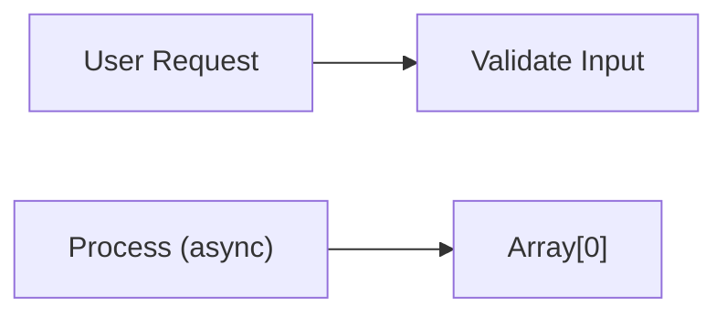
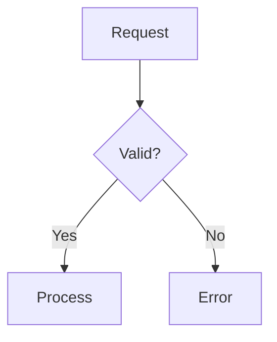

# Mermaid Diagram Guide

**Purpose**: Create information-dense, accessible diagrams that enhance understanding.

**Core Principle**: Diagrams reveal relationships that prose cannot express efficiently. If a list or table works, use that instead.

---

## Universal Rules

### Rule 1: NEVER Diagram Linear Sequences

This is the cardinal rule that must never be violated.

**NEVER do this**:

**Always use list**:
1. Step 1
2. Step 2
3. Step 3
4. Step 4

### Rule 2: Escape All Labels with Spaces

**Critical**: Labels containing spaces MUST be quoted or rendering breaks.

**Characters requiring quotes**:
- Spaces: `"User Request"`
- Parentheses: `"Process (async)"`
- Brackets: `"Array[0]"`

### Rule 3: Add Meaning Comments

**Pattern**: Use `%%` to explain non-obvious aspects for AI agents and future maintainers.

### Rule 4: Keep Diagrams Focused

- **<12 nodes** per diagram (split complex flows)
- **<6 participants** in sequence diagrams
- If it's complex, split into multiple diagrams
