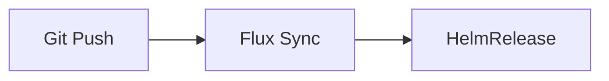

# Writing Documentation as Wisdom Triggers

> **Mission**: Encode durable wisdom in minimal tokens, creating triggers that activate full understanding in any cognitive system.

## Entry Point: Documentation Guides

This is the foundational philosophy. Read this first, then use specialized guides as needed:
- **[writing-capsules.md](./writing-capsules.md)** - Token-efficient concept format (Invariant->Example->Depth)
- **[mermaid-diagram-guide.md](./mermaid-diagram-guide.md)** - Visual documentation reference
- **[Ethos.md](./Ethos.md)** - Documentation values (hard rules, strong guidance)

---

## Core Principles

### 1. Token Economics: Every Token Must Earn Its Place

Modern LLMs use subword tokenization that affects concept integrity:
- `CamelCase` -> Often single token
- `hyphenated-terms` -> Usually 3+ tokens

**Example**:
```markdown
GOOD: "HelmRelease" (1-2 tokens)
BAD: "helm release configuration resource" (5-6 tokens)
```

### 2. Capsule Architecture: Compress Wisdom Into Invariants

Distill each concept into a stable, minimal truth that can be expanded when needed.
See `writing-capsules.md` for complete format specification.

### 3. Multi-Modal Encoding: Visual + Verbal + Semantic

Combine text, structure, and visuals to create multiple retrieval paths to the same wisdom.

**Mermaid diagrams with assistive comments**:


**Critical**: Always escape Mermaid labels containing spaces or special characters with quotes.

---

## Success Metrics

Your documentation succeeds when:
- Readers grasp concepts in seconds, not minutes
- AI finds and extracts exactly what's needed
- Knowledge transfers intact across contexts
- The system becomes navigable
